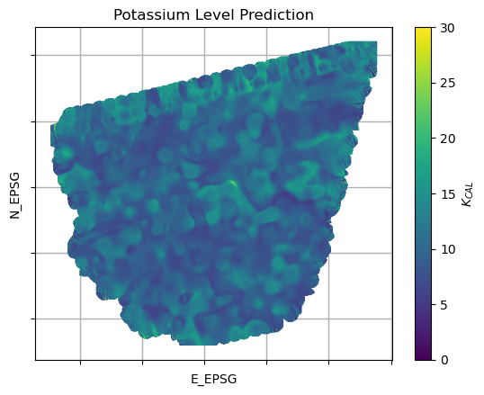
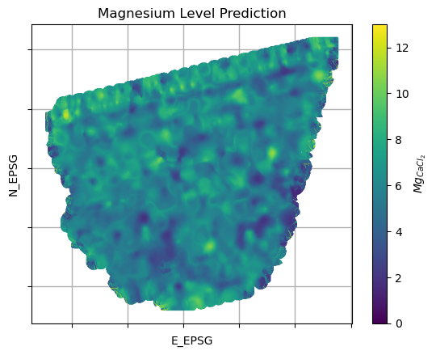
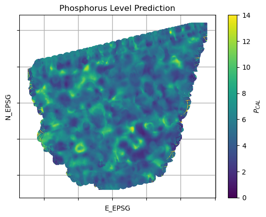

# Predicting Mineral Levels from Site Sensor Data - *Project Summary*

I participated in the BonaRes – I4S – DUS at the Martin-Luther-University Halle-Wittenberg as a student assistant. I applied ML methods to predict mineral levels from site sensor data using Python.

## Project Background

##### BonaRes

- BonaRes is a collaborative project in Germany divided into 10 interdisciplinary projects (modules)
- It aims to secure productivity and efficiency of soil as a resource (maintain soil fertility)
- Official Website: [https://www.bonares.de/](https://www.bonares.de/)
##### I4S

- I4S (Intelligence for Soil) is the precision farming module that developed a system that provides site-specific recommendations for fertilization and other management measures in order to maintain soil fertility and reduce environmental pollution
- Official Website: [https://www.bonares.de/service-portal/projects/intelligence-for-soil-i4s](https://www.bonares.de/service-portal/projects/intelligence-for-soil-i4s)

##### DUS

- DUS = Decision Support System (*germ. EUS = Entscheidungsunterstützungssystem*)
- Subproject of the I4S, evaluating the site sensor data collected by the sensors (RappidMapper and RappidProfiler)
- Official Report: [https://oa.tib.eu/renate/items/8ccb1b6f-9742-41e9-805f-60711585cfe6/full]( https://oa.tib.eu/renate/items/8ccb1b6f-9742-41e9-805f-60711585cfe6/full)

## My Contribution to the Project

##### Spatial Alignment of RappidMapper Sensor Data

- The RappidMapper sensor platform collected data (NIR, EC, Gamma and pH) with different frequencies, hence the coordinates of data points were not aligning
- I used the k-d-tree data structure to make spatial and nearest-neighbor searches fast
- This allowed me to efficiently map the nearest data points, which is needed during training and prediction

##### Data Interpolation

- I applied the Kriging method to interpolate data, which is standard in this field
- This procedure is necessary to get predictions across the site
- I used the Python multiprocessing library to perform parallel computation for this task running on the CPU

##### Model Selection

- I experimentally evaluated different ML regression models:
  - Linear, Ridge, Lasso, Elastic Net, Partial Least Squares, Random Forest, Support Vector, Bayesian Ridge, Neural Networks
- I also used different features (feature selection) to reduce complexity and investigate their influence:
  - PCA, subsets of NIR spectra (evaluated from relevance for minerals)

##### Python Modules for DUS Software

- I implemented my pipeline such that different prediction options were available
- Those were necessary as a trade-off between accuracy and computational speed, depending on the actual implementation inside the software, meaning it was not clear at that point where the computation would take place

##### Python – CLI

- CLI wrapper written in Python to execute my scripts from the command line

##### Collaborations

- Team meetings with software developers in Berlin to communicate progress and integrate my Python implementations into their API

##### Documentation

- Writing a manual for my Python scripts and my computational environment
- Writing semester reports

## Illustration

- Fig. 1 illustrates the mineral prediction of an anonymized field
- This doesn't show the final model output and was added for visualization purposes

| Potassium | Magnesium | Phosphorus |
|:---:|:---:|:---:|
|  |  |  |

*Figure 1: Illustrative prediction outputs for three mineral levels across an anonymized field. Intermediate results, not the final model output. Left: Potassium. Middle: Magnesium. Right: Phosphorus.*